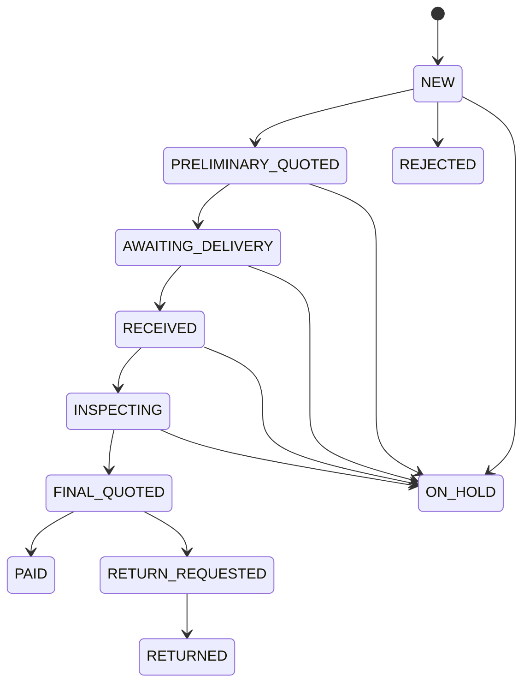
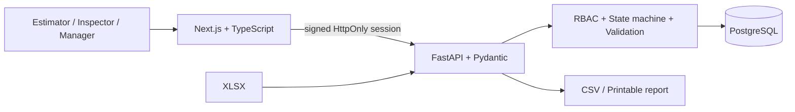

# FA Reuse Flow

ระบบสาธิตสำหรับจัดการกระบวนการรับซื้อและตรวจสภาพอุปกรณ์ Factory Automation ตั้งแต่การนำเข้า Excel ไปจนถึงการตรวจ QC, เสนอราคาสุดท้าย, ชำระเงิน หรือคืนสินค้า

> ระบบนี้ใช้ข้อมูลสังเคราะห์สำหรับการสาธิต ไม่ได้เชื่อมต่อระบบจริงและไม่ใช้ข้อมูลลูกค้าจริง

## สิ่งที่โปรเจกต์นี้สาธิต

- นำเข้า `.xlsx` แบบ preview ก่อนบันทึก พร้อม error รายแถวและป้องกัน serial ซ้ำ
- Workflow ที่ตรวจลำดับด้วย state machine และแยกสิทธิ์ `Estimator`, `Inspector`, `Manager`
- QC checklist บังคับกรอกก่อนเสนอราคาสุดท้าย พร้อมเกรด `N/A/B/C/D/JUNK`
- ติดตาม SLA ตรวจสินค้า 3 วันทำการในเขตเวลา `Asia/Bangkok`
- Audit log ทุกการเปลี่ยนสถานะ พร้อมผู้ดำเนินการ เวลา และหมายเหตุ
- Dashboard งานค้าง งานใกล้/เกิน SLA สัดส่วนสถานะ และ cycle time จากข้อมูลจำลอง
- CSV export และรายงานเคสที่พิมพ์ได้
- Backend tests, frontend tests และ end-to-end demo scenarios

## เริ่มใช้งานด้วย Docker

ต้องมี Docker Desktop จากนั้นเปิด PowerShell ที่โฟลเดอร์โปรเจกต์แล้วรัน:

```powershell
Copy-Item .env.example .env
docker compose up --build
```

เปิด [http://localhost:3000](http://localhost:3000) ระบบจะสร้างฐานข้อมูลและข้อมูลเดโมให้อัตโนมัติ ส่วน API health check อยู่ที่ [http://localhost:8000/health](http://localhost:8000/health)

บัญชีเดโมทั้งหมดใช้รหัสผ่าน `Demo123!`

| บทบาท | อีเมล | หน้าที่ในเดโม |
|---|---|---|
| Estimator | `estimator@demo.local` | นำเข้าไฟล์และประเมินราคาเบื้องต้น |
| Inspector | `inspector@demo.local` | รับสินค้าและบันทึกผล QC |
| Manager | `manager@demo.local` | ยืนยันราคาสุดท้าย ชำระเงิน หรือคืนสินค้า |

> บัญชีและ secret เริ่มต้นมีไว้สำหรับ local demo เท่านั้น ต้องเปลี่ยนก่อนนำไปใช้ในสภาพแวดล้อมอื่น

## เส้นทางเดโมแนะนำ

1. เข้าระบบเป็น Estimator แล้วอัปโหลด `sample-data/buyback-items-errors.xlsx` เพื่อแสดง validation รายแถว
2. เปลี่ยนเป็น `sample-data/buyback-items-valid.xlsx`, ตรวจ preview แล้ว commit เพื่อสร้างเคส
3. ใส่ราคาเบื้องต้นและส่งเคสไปยังขั้นรอรับสินค้า
4. เข้าระบบเป็น Inspector รับสินค้า เริ่มตรวจ และกรอก QC ให้ครบ
5. เข้าระบบเป็น Manager ตรวจราคาสุดท้ายแล้วเลือก `PAID` หรือ `RETURN_REQUESTED → RETURNED`
6. เปิด audit timeline, dashboard, CSV export และหน้าพิมพ์รายงาน

## Workflow



Transition ที่ผิดลำดับตอบ `409 Conflict`; ผู้ใช้ไม่มีสิทธิ์ตอบ `403 Forbidden`; transition ที่สำเร็จทุกครั้งสร้าง audit event

## สถาปัตยกรรม



โปรเจกต์เป็น monorepo แบ่งเป็น:

- `apps/web` — หน้าเว็บภาษาไทยด้วย Next.js, TypeScript และ Tailwind CSS
- `apps/api` — API, business rules, SQLAlchemy models และ Alembic migration
- `sample-data` — ไฟล์ XLSX ที่ผ่านและไม่ผ่าน validation สำหรับเดโม

## การตรวจคุณภาพ

```powershell
# Backend (Python 3.12+)
cd apps/api
python -m pip install -r requirements-dev.txt
pytest
ruff check app tests

# Frontend checks (Node.js 20.9+)
cd ../web
npm ci
npm run lint
npm run typecheck
npm run test
npm run build

# End-to-end (เปิด docker compose up -d ไว้ก่อน)
$env:PLAYWRIGHT_BASE_URL="http://127.0.0.1:3000"
npm run test:e2e
```

ชุดทดสอบครอบคลุม state transitions, role permissions, XLSX validation, duplicate serial, QC completeness, SLA ข้ามวันหยุด, audit log และเส้นทางสำคัญแบบ end-to-end

## ขอบเขตของเดโม

- Requirement มาจากข้อมูลสาธารณะ ไม่ได้ผ่านการสัมภาษณ์ process owner ของบริษัท
- ใช้ข้อมูลสังเคราะห์และ scenario-based self-UAT ยังไม่มีผู้ใช้ภายนอกทดลอง
- SLA 3 วันทำการและ permission matrix เป็นสมมติฐานที่ต้อง validate ก่อนใช้งานจริง
- ไม่มี integration กับ Shopify, Google Form, LINE, email, ธนาคาร หรือระบบชำระเงินจริง
- ไม่มีการอ้างผลลดเวลา ต้นทุน หรือข้อผิดพลาด เพราะยังไม่มี baseline จากการใช้งานจริง
